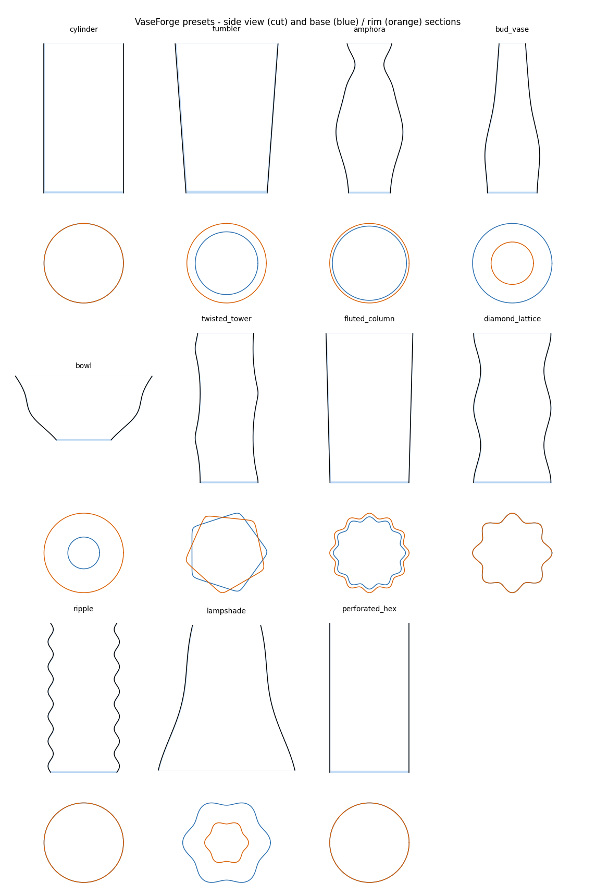

# VaseForge

**Parametric vases, containers and lampshades for 3D printing, as native Fusion geometry.**

Most online vase generators export an STL, so you cannot model a base, a lamp
holder or a mechanism around them. VaseForge builds ordinary Fusion B-Rep
geometry (sketches, loft, cut) in your own design timeline, so everything else
can be modelled right next to it, and it refuses settings that would produce
broken geometry, using explicit maths instead of trial and error.



## Features

* **Profile**: height, base/top radius, belly and neck bumps.
* **Cross-section**: circle or smooth polygon (rounded corners).
* **Patterns**: lobes + twist, counter-rotating lobes (diamond lattice), vertical waves.
* **Walls**: perpendicular wall thickness (tilt-compensated), floor, open bottom
  for lampshades, optional base hole.
* **Perforations**: rows of circles, hexagons, diamonds or slots, staggered or not,
  holes scale with the local radius.
* **Live safety limits**: maximum wall, lobe depth and twist are computed from the
  geometry ([docs/MATH.md](docs/MATH.md)); invalid settings disable the OK button and say why.
* **Wireframe preview** in the viewport while you edit.
* **Design-friendly output**: one timeline group, helper sketches hidden, reference
  user parameters (`VF_height`, `VF_base_diameter`, `VF_wall`, ...) to size your base.
* English / Spanish UI (follows Fusion's language).

## Install

1. Download or clone this repository.
2. In Fusion: **Utilities > Add-Ins > Scripts and Add-Ins > Add-Ins tab > "+"**, choose the
   `VaseForge` folder (the one containing `VaseForge.py`), then **Run**.
   Tick *Run on Startup* if you like.
3. The **VaseForge** button appears in **Solid > Create**.

The design must be **parametric** (history on). The vase is built at the origin,
axis = Z, base on the XY plane.

## Use

Pick a preset, tweak the parameters, watch the status box. Press OK and wait while
the sections are built (a progress bar is shown). Later runs remember your last values.

## Project layout

```
VaseForge.py / .manifest       add-in entry point
vaseforge_lib/core/            pure Python maths (no Fusion): model, validation, presets, layout
vaseforge_lib/fusion_layer/    everything that touches adsk.*: dialog, builder, perforations, preview
tests/                         pytest suite for the maths (runs in CI without Fusion)
tools/gallery.py               renders the preset gallery from the same maths
docs/MATH.md                   derivations of the limits
```

Run the tests with `python -m pytest -q tests`.

## Status and roadmap

Alpha. The maths layer is unit-tested; the Fusion layer is written against the public
API documentation and still needs wider testing on real designs. Please open issues
with the Fusion version, parameters and the error message.

* [ ] Re-edit an existing vase in place (Custom Features) instead of regenerating
* [ ] Voronoi and image-driven perforations
* [ ] Spiral-vase (single wall) mode with printer-line-width presets
* [ ] Rim and base fillets, lamp-holder collar presets (E14 / E27)
* [ ] Batch export of variants (STL / STEP)

## Resumen en español

VaseForge es un add-in de Fusion que genera vasos, recipientes y cubiertas de lámpara
paramétricos con geometría nativa (no STL), para poder modelar bases y mecanismos junto
a la pieza. Calcula límites seguros (pared, profundidad de lóbulo, torsión) con
modelos matemáticos y avisa antes de generar geometría inválida. Instalación: añade la
carpeta `VaseForge` desde *Utilidades > Complementos > Scripts y complementos*.
